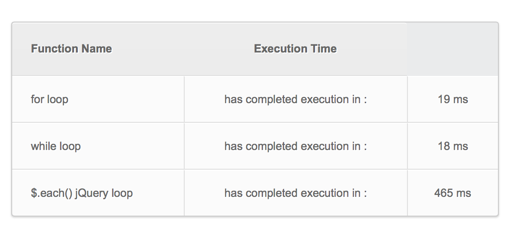

# JavaScript function timer.
This is a basic function timer for testing execution time of various funtions and methods. Wrapping each function in a basic
timer start and timer stop call will process each function, and output its results to a table as seen below.
